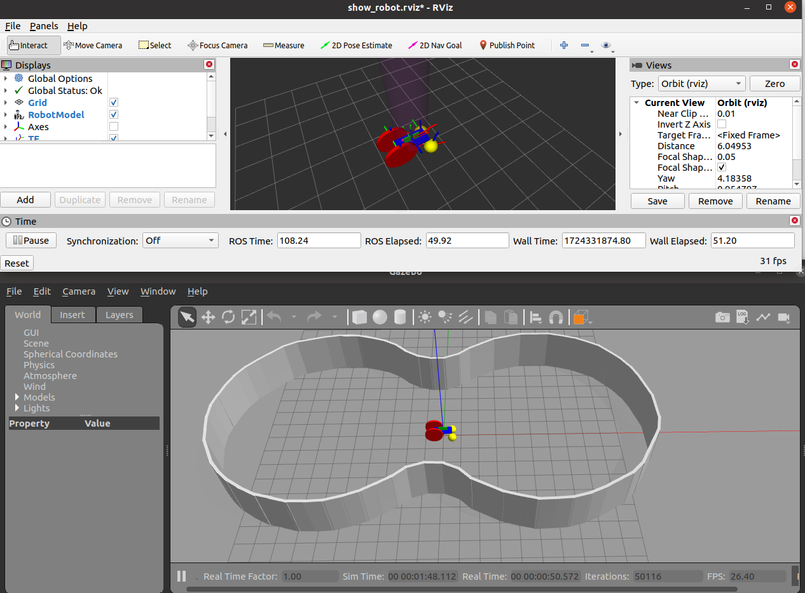
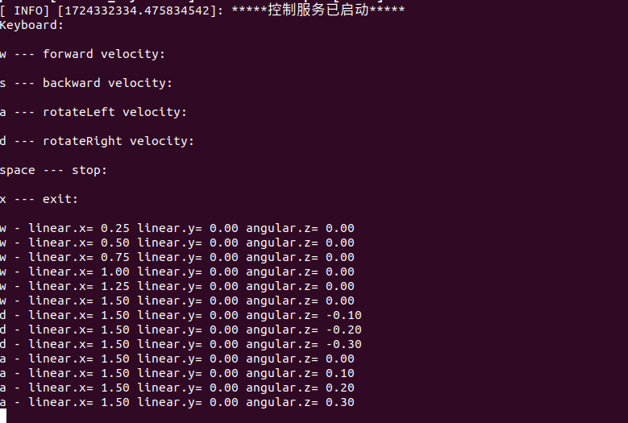

# sim_ros_gazebo_car

## 0_功能包src目录结构

```bash
src
├── CMakeLists.txt
├── control(控制方法只写了pid)
│   ├── CMakeLists.txt
│   ├── include
│   │   └── control_pid.h
│   ├── package.xml
│   └── src
│       └── control_pid.cc
├── custom_msgs(自定义消息,只有服务通讯)
│   ├── CMakeLists.txt
│   ├── msg
│   ├── package.xml
│   └── srv
│       └── control_param.srv
├── quaternion(四元数)
│   ├── CMakeLists.txt
│   ├── include
│   │   └── quaternion.h
│   ├── package.xml
│   └── src
│       └── quaternion.cc
├── robot_control(机器人控制)
│   ├── CMakeLists.txt
│   ├── launch
│   │   └── robot_control.launch
│   ├── package.xml
│   └── src
│       ├── control_keyboard.cc
│       ├── control_service.cc
│       └── sensor.cc
└── robot_model(机器人模型与仿真环境)
    ├── CMakeLists.txt
    ├── config
    │   ├── show_robot.rviz
    │   └── wheel_control.yaml
    ├── launch
    │   ├── env.launch
    │   ├── gazebo.launch
    │   └── rviz.launch
    ├── package.xml
    ├── urdf
    │   ├── imu.xacro
    │   ├── inertial.xacro
    │   ├── init.xacro
    │   └── robot.xacro
    └── worlds(gazebo墙壁环境)
        ├── pool_shape_playground.world
        └── pool_shape_twoCircles.world
```

## 1_依赖

安装``joint_state_controller``和``ros-noetic-effort-controllers``

```bash
sudo apt-get install ros-noetic-joint-state-controller
sudo apt-get install ros-noetic-effort-controllers
```

## 2_使用方法

1. catkin_make编译完后，打开两个终端，依次运行工作空间下``run_env.sh``与``run_robot.sh``

```bash
./run_env.sh
```



2. 启动所有和机器人控制相关组件，``w``,``s``,``a``,``d``控制移动和旋转速度

```
./run_robot.sh
```



## 3_墙壁形状修改

``robot_model``->``worlds``文件夹下添加新的``.world``文件，并在``robot_model``->``launch``->``gazebo.launch``中修改.world文件名

```launch
// 修改 pool_shape_twoCircles.world 文件为其他 .world 文件可以加载不同墙壁形状
<arg name="pool_shape" default="pool_shape_twoCircles.world"/>
```

## 4_IMU安装姿态修改

修改``robot_model``->``urdf``->``robot.xacro``中的如下内容：

```
<!-- 若要修改IMU摆放位姿，修改下面 xyz 和 rpy 参数 -->
<!-- xyz 为imu_link中心点相较于base_link中心点的三根轴上的偏移量 -->
<!-- rpy 为imu_link相较于base_link的姿态角 -->
<!-- 这里将 rpy 的 r 设置为 pi/2，表示将IMU绕 x 轴旋转 90° 摆放，以模拟上墙时的imu状态 -->
<!-- 由于 imu 以 rpy="${pi/2} 0 0" 的姿态摆放，需要让机器人 顺时针 沿墙运动，才是对上墙状态的正确模拟 -->
<origin xyz="0 0 ${base_link_width/4 + base_link_height/2}" rpy="${pi/2} 0 0" />
```


